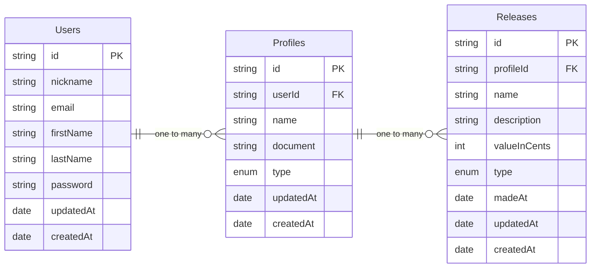

# 💵 MyFinances

Um aplicativo de gerenciamento de finanças, tenha o total controle sobre seus gastos, rendimentos e projeções!

Esse repositório contém:

1. [server](server) a api da aplicação.
2. [clients/web-app](clients/web-app) o frontend da aplicação.

## Conteúdo

- [Idealização](#-idealização)
- [Estrutura](#-estrutura)
- [Tecnologias](#-tecnologias)
- [Imagens](#-imagens)
- [Mantedores](#-mantedores)
- [Licença](#-licença)

## 📃 Idealização

Acompanhe abaixo todo o caminho de idealização e de criação das regras de negócio:

Objetivo: Um aplicativo para gerenciamento de finanças de maneira intuitiva e completa. Feito com foco em organização e agilidade.

#### Regras de negócio:

- [ ] **Finanças**: O usuário poderá criar lançamentos personalizados, sejam eles Renda, Gasto ou Investimento. Afim de manter o controle total de suas finanças.
- [ ] **Organização**: O usuário poderá separar suas finanças em diferentes perfis e poderá organizar lançamentos em diferentes grupos.
- [ ] **Agendamentos**: O usuário poderá criar agendamentos para lançamentos, sejam eles recorrentes ou não.
- [ ] **Integrações**: O usuário poderá integrar sua conta com diferentes aplicativos, a fim de integrar automaticamente gastos/investimentos diretamente com um perfil.
- [ ] **IA**: O usuário poderá gerar um planejamento de gastos baseado em renda, investimentos e outros gastos desejados utilizando inteligência artificial.

#### Requisitos funcionais:

- [ ] **Usuários**

  - [x] Deverá ser possível o cadastro do usuário com todos os campos necessários.
  - [x] Deverá ser possível o login do usuário com os campos email e senha.
  - [x] Deverá ser possível a busca pelos dados de um usuário autenticado.
  - [x] Deverá ser possível a atualização dos dados de um usuário autenticado.
  - [x] Deverá ser possível a atualização de senha de um usuário autenticado.
  - [ ] Deverá ser possível verificar o email de um usuário autenticado.
  - [ ] Deverá ser possível a atualização do email de um usuário.
  - [ ] Deverá ser possível excluir um usuário.

- [x] **Perfis**

  - [x] Deverá ser possível a criação de um perfil diretamente relacionado a um usuário autenticado.
  - [x] Deverá ser possível a busca dos dados de um perfil especifico.
  - [x] Deverá ser possível a atualização de um perfil especifico.
  - [x] Deverá ser possível excluir um perfil especifico.

- [ ] **Lançamentos**

  - [x] Deverá ser possível a criação de novos lançamentos diretamente associados a um perfil.
  - [x] Deverá ser possível a busca de dados de um lançamento especifico.
  - [x] Deverá ser possível a busca por lançamentos recentes associados a um perfil (limite de 15 items & filtro por período).
  - [x] Deverá ser possível a busca por múltiplos lançamentos associados a um perfil com paginação (movimentações).
  - [x] Deverá ser possível atualizar um lançamento especifico.
  - [x] Deverá ser possível excluir um lançamento especifico.
  - [ ] Deverá ser possível buscar o valor total de lançamentos por periodos (INCOME, OUTCOME, INVESTMENT).

- [ ] **Grupamentos**

  - [ ] Deverá ser possível a criação de grupamentos diretamente associados a um perfil.
  - [ ] Deverá ser possível listar todos os grupamentos relacionados a um perfil especifico.
  - [ ] Deverá ser possível buscar dados de um grupamento especifico.
  - [ ] Deverá ser possível atualizar um grupamento especifico.
  - [ ] Deverá ser possível excluir um grupamento especifico.
  - [ ] Deverá ser possível associar/desassociar um **Lançamento** a um grupamento especifico.

- [ ] **Agendamentos**
  - [ ] Deverá ser possível a criação de um agendamento diretamente ligado a um perfil.
  - [ ] Deverá ser possível listar todos os agendamentos relacionados a um perfil especifico.
  - [ ] Deverá ser possível buscar dados de um agendamento especifico.
  - [ ] Deverá ser possível atualizar um agendamento especifico.
  - [ ] Deverá ser possível excluir um agendamento especifico.

#### Requisitos não funcionais:

- [ ] **Geral**

  - [ ] O sistema deve ser construído seguindo boas práticas e metodologias como: **SOLID, DDD, Clean Arch e TDD**.
  - [ ] O sistema deve possuir CI/CD (Github actions).
  - [ ] O sistema deve possuir documentação (Swagger).

- [ ] **Usuários**
  - [x] A autenticação deverá ocorrer através de um token JWT.
  - [x] A senha do usuário deverá ser salva como um HASH.
  - [ ] A verificação de emails deverá ocorrer através de um email de confirmação.

## 💀 Estrutura

## 🎯 Tecnologias

Algumas das possíveis tecnologias a serem usadas no projeto:

- [x] **Web App**

  - [x] [NextJS](https://nextjs.org) (SSR)
  - [x] [TailwindCSS](https://tailwindcss.com) (Styles)
  - [x] [Zustand](https://zustand.docs.pmnd.rs) (State management)

- [x] **API**

  - [x] [NestJS](https://nestjs.com)
  - [x] [MongoDB](https://www.mongodb.com)
  - [x] [Jest](https://jestjs.io/) (TDD)

- [ ] **Infraestrutura**
  - [ ] [Pulumi](http://pulumi.com) (IAC)
  - [ ] [AWS]()

## 📷 Imagens

Veja imagens de como o frontend da aplicação está até o momento.

## 👻 Mantedores

[@zyxsz](https://github.com/zyxsz)

## 🔓 Licença

> Em breve.
